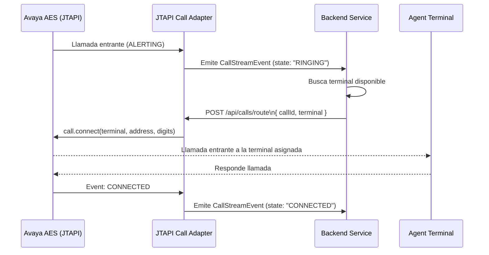

# ☎️ Adaptador de Llamadas JTAPI – Enrutamiento de Llamadas de Emergencia

Este módulo escucha eventos JTAPI de Avaya, emite objetos simplificados `CallEvent` y expone una API para enrutar llamadas a terminales de agentes disponibles.

---

## 🔧 Descripción General

Este adaptador es parte de un sistema mayor de respuesta a emergencias. Su única responsabilidad es **escuchar eventos de llamadas de Avaya AES**, exponerlos de forma reactiva y permitir que sistemas externos (como un backend) decidan cómo manejar esas llamadas.

---

## 📶 Diagrama de Secuencia



---

## 🔁 Ciclo de Vida de los Eventos

- `ringing`: Detectado cuando la llamada está alertando en el terminal monitoreado
- `connected`: Cuando el agente contesta la llamada
- `disconnected`: Cuando la llamada termina o se pierde

---

## 📤 API – Enrutar Llamada a Terminal

**Endpoint:**  
`POST /api/calls/route`

**Request Body:**
```json
{
  "callId": "Call@42af1134",
  "terminal": "1003"
}
```

**Response:**
```http
200 OK
✅ Llamada enrutada exitosamente al terminal: 1003
```

---

## ✅ Dependencias

- Spring Boot
- SLF4J + Lombok
- Avaya JTAPI SDK (ecsjtapia.jar)
- Reactor Core (for Flux, Consumer)

---

## 📚 Recursos

- [Guía del Programador Avaya JTAPI (10.1+)](https://documentation.avaya.com/bundle/AESOverviewAndSpec_R10.2.x/page/JTAPIProgrammers.html)
- [Editor en Vivo de Mermaid](https://mermaid.live/)

---

## 🔐 Nota de Seguridad

Asegúrate de que el adaptador tenga permisos para:
- Controlar el terminal monitoreado (origen)
- Conectarse a los terminales de destino (agentes)
- Usar las credenciales de acceso AES y configuración TSAPI.PRO adecuadas

---

## 🧠 Maintainer Note

Este adaptador **no decide cómo enrutar**. Esa lógica vive en el backend.  
Solo:
- Escucha
- Emite
- Ejecuta comandos de enrutamiento cuando se le indica

