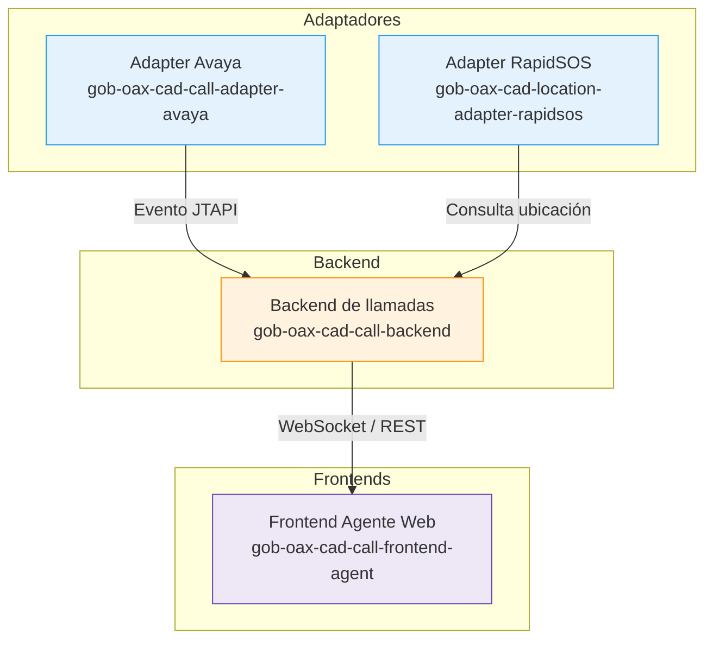
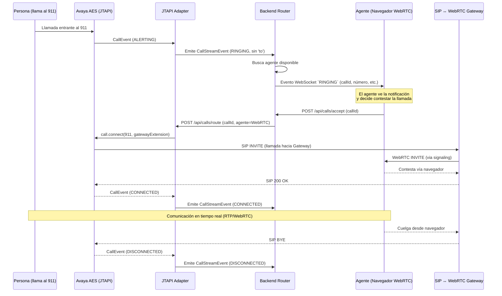

# 📞 Sistema de Atención de Llamadas de Emergencia

Este monorepo contiene todos los componentes del sistema de atención de llamadas 911, incluyendo el backend, adapters de integración y la interfaz del agente.

---

## 📁 Estructura del Monorepo

```
cad/
├── adapters/
│   ├── gob-oax-cad-call-adapter-avaya/           # Adapter para escuchar eventos JTAPI desde Avaya
│   └── gob-oax-cad-location-adapter-rapidsos/    # Adapter para consumir la API externa de RapidSOS
│
├── backend/
│   └── gob-oax-cad-call-backend/                 # Backend principal que enruta llamadas y coordina entre adapters y agentes
│
├── frontend/
│   └── gob-oax-cad-call-frontend-agent/          # Aplicación Angular para agentes que reciben y gestionan llamadas WebRTC
├── deployment/
│   └── wiremock/              # Mappings simulados para el API de RapidSOS
│       ├── mappings/          # Respuestas mock definidas por escenario
│       └── __files/           # Cuerpos de respuesta externos (opcional)
│
└── README.md
```

---

## 🧩 Componentes

### 🔌 Adapters

- **gob-oax-cad-call-adapter-avaya**  
  Microservicio que escucha eventos del sistema Avaya (AES) usando JTAPI. Transforma los eventos de llamadas en eventos internos para el backend.

- **gob-oax-cad-location-adapter-rapidsos**  
  Microservicio cliente de la API de RapidSOS. Permite consultar ubicación de llamadas usando el número telefónico.

### ⚙️ Backend

- **gob-oax-cad-call-backend**  
  Servicio central del sistema. Gestiona:
  - Asignación de llamadas a agentes disponibles.
  - Comunicación bidireccional con adapters.
  - Emisión de eventos a la interfaz del agente por WebSocket.
  - Enrutamiento de llamadas hacia extensiones SIP/WebRTC.

### 🖥️ Frontend

- **gob-oax-cad-call-frontend-agent**  
  Interfaz web Angular para agentes que reciben llamadas.  
  Funcionalidades:
  - Registro de sesión.
  - Recepción de llamadas y eventos (entrante, conectada, finalizada).
  - Consulta de ubicación de quien llama (opcional).
  - Comunicación vía WebRTC con gateway SIP.

---

## 🛠️ Tecnologías utilizadas

- **Java 17 + Spring Boot** – Para todos los servicios backend.
- **Angular 19** – Para el frontend de agentes.
- **JTAPI (Avaya AES)** – Para integración con la central telefónica.
- **RapidSOS API** – Para obtención de datos de localización.
- **WebSocket + WebRTC** – Para comunicación y audio en tiempo real.

---

## 🧬 Diagrama de Componentes



---

### 🎯 Resumen del flujo
Este diagrama describe el proceso de atención de una llamada de emergencia desde una persona que marca al 911, pasando por el sistema Avaya, un backend de control y un gateway SIP↔WebRTC, hasta que finalmente la llamada es atendida por un agente desde su navegador.



---

## 🧪 Ejecución de los Componentes

### 🔧 1. Backend y Adapters (Spring Boot)

Cada servicio Spring Boot puede ejecutarse con Maven:

```bash
# JTAPI Adapter
cd adapters/gob-oax-cad-call-adapter-avaya
mvn clean spring-boot:run

# RapidSOS Adapter
cd adapters/gob-oax-cad-location-adapter-rapidsos
mvn clean spring-boot:run

# Router Backend
cd backend/gob-oax-cad-call-backend
mvn clean spring-boot:run
```

### 🌐 2. Frontend (Angular)

Ejecuta el panel del agente con Angular CLI:

```bash
cd frontend/gob-oax-cad-call-frontend-agent
npm install
ng serve
```

Esto abrirá la aplicación en http://localhost:4200.

### 🧪 3. Simulación de RapidSOS con WireMock

Puedes usar WireMock como mock server para simular respuestas de la API de RapidSOS. Requiere Java 17+:

```bash
cd /ruta/externa/a/wiremock/
java -jar wiremock-standalone.jar   --port 8090   --root-dir /ruta/al/monorepo/cad-avaya/deployment/wiremock/
```

#### Directorio de Mappings

El directorio `deployment/wiremock/` dentro del monorepo contiene:

- `mappings/`: archivos `.json` que definen los endpoints simulados y sus respuestas.
- `__files/`: archivos opcionales con cuerpos de respuesta externos (ej. JSON, imágenes, etc).


---

## ⚠️ Notas
- Todos los servicios corren por defecto en los siguientes puertos:
  - JTAPI Adapter: 8081
  - RapidSOS Adapter: 8082
  - Router Backend: 8080
  - Angular (dev): 4200

- Los componentes se comunican entre sí mediante HTTP y WebSocket.
