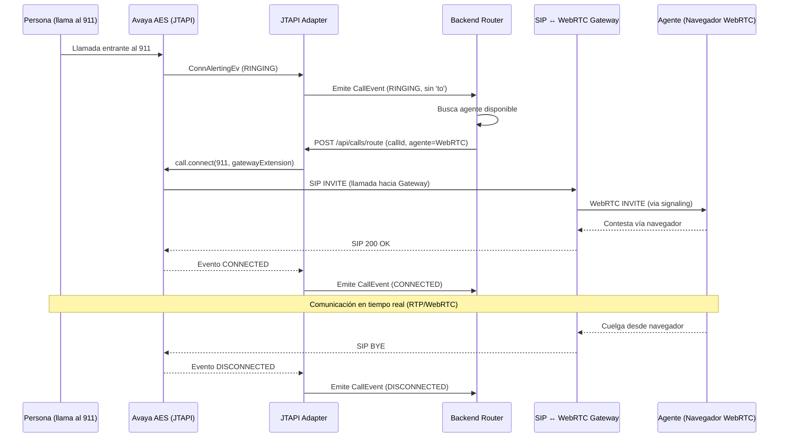

# ☎️ Adaptador de Llamadas JTAPI – Enrutamiento de Llamadas de Emergencia

Este módulo escucha eventos JTAPI de Avaya, emite objetos simplificados `CallEvent` y expone una API para enrutar llamadas a terminales de agentes disponibles.

---

## 🔧 Descripción General

Este adaptador es parte de un sistema mayor de respuesta a emergencias. Su única responsabilidad es **escuchar eventos de llamadas de Avaya AES**, exponerlos de forma reactiva y permitir que sistemas externos (como un backend) decidan cómo manejar esas llamadas.

---

## 📶 Diagrama de Secuencia

### 🎯 Resumen del flujo
Este diagrama describe el proceso de atención de una llamada de emergencia desde una persona que marca al 911, pasando por el sistema Avaya, un backend de control y un gateway SIP↔WebRTC, hasta que finalmente la llamada es atendida por un agente desde su navegador.



### 🔄 Participantes

| Participante          | Rol                                                                      |
| --------------------- | ------------------------------------------------------------------------ |
| ☎️ Persona            | Ciudadano que realiza la llamada al número de emergencia (911)           |
| 📞 Avaya AES/CM       | Recibe la llamada mediante infraestructura telefónica SIP/JTAPI          |
| 🧩 JTAPI Adapter      | Componente que escucha eventos de llamadas y conecta según instrucciones |
| 🧠 Backend Router     | Decide qué agente atenderá la llamada y solicita el enrutamiento         |
| 🌐 Gateway SIP↔WebRTC | Media gateway que convierte la llamada SIP en WebRTC                     |
| 🧑 Agente Web         | Usuario que atiende la llamada desde el navegador (WebRTC)               |

### 🧭 Pasos del flujo
1. **Llamada entrante**  
   La persona realiza una llamada desde la red telefónica pública hacia el número 911.


2. **Avaya recibe la llamada**  
   El sistema Avaya AES/CM la registra en una línea configurada (ej. `911`).


3. **JTAPI Adapter detecta el evento `CallEvent`**  
   El adapter emite un evento `RINGING` al backend con el `callId` y el número llamante (`from`).


4. **Backend elige un agente disponible**  
   Basado en disponibilidad, el backend selecciona un agente con sesión WebRTC activa.


5. **Backend ordena enrutar la llamada al gateway SIP (extensión del agente)**  
   El backend llama a `routeCall(callId, "8801")`, donde `"8801"` es la extensión SIP registrada por el navegador del agente.


6. **Avaya enruta la llamada al Gateway SIP↔WebRTC**  
   La infraestructura Avaya establece una sesión SIP con el gateway.


7. **Gateway inicia sesión WebRTC con el navegador**  
   El gateway recibe la llamada SIP y, mediante WebSocket y SDP, inicia la conexión WebRTC con el navegador del agente.


8. **El agente contesta en el navegador**  
   El usuario acepta la llamada desde la UI. El gateway envía RTP/SRTP al navegador.


9. **El adapter detecta `CONNECTED` y luego `DISCONNECTED`**  
   El backend recibe y registra estos eventos para actualizar el estado de la llamada.

### 🧠 Notas importantes

- La comunicación de medios (voz) **no pasa por el backend**
- El backend solo **decide, enruta y notifica**
- El agente necesita estar registrado en el gateway usando WebRTC y conectado vía `wss://...`
---

## 🔁 Ciclo de Vida de los Eventos

- `ringing`: Detectado cuando la llamada está alertando en el terminal monitoreado
- `connected`: Cuando el agente contesta la llamada
- `disconnected`: Cuando la llamada termina o se pierde

---

## 📤 API – Enrutar Llamada a Terminal

**Endpoint:**  
`POST /api/calls/route`

**Request Body:**
```json
{
  "callId": "Call@42af1134",
  "terminal": "1003"
}
```

**Response:**
```http
200 OK
✅ Llamada enrutada exitosamente al terminal: 1003
```

---

## ✅ Dependencias

- Spring Boot
- SLF4J + Lombok
- Avaya JTAPI SDK (ecsjtapia.jar)
- Reactor Core (for Flux, Consumer)

---

## 📚 Recursos

- [Guía del Programador Avaya JTAPI (10.1+)](https://documentation.avaya.com/bundle/AESOverviewAndSpec_R10.2.x/page/JTAPIProgrammers.html)
- [Editor en Vivo de Mermaid](https://mermaid.live/)

---

## 🔐 Nota de Seguridad

Asegúrate de que el adaptador tenga permisos para:
- Controlar el terminal monitoreado (origen)
- Conectarse a los terminales de destino (agentes)
- Usar las credenciales de acceso AES y configuración TSAPI.PRO adecuadas

---

## 🧠 Maintainer Note

Este adaptador **no decide cómo enrutar**. Esa lógica vive en el backend.  
Solo:
- Escucha
- Emite
- Ejecuta comandos de enrutamiento cuando se le indica

