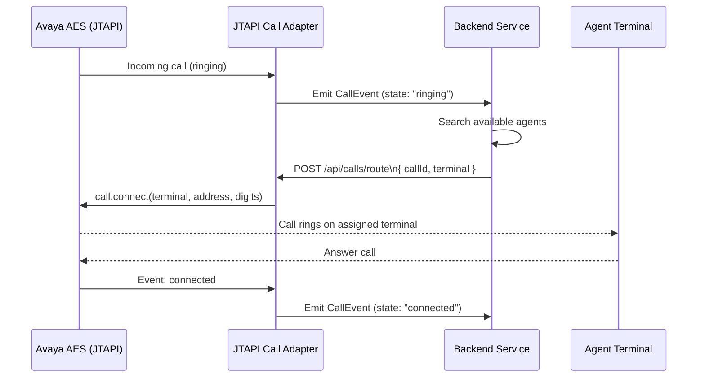

# ☎️ JTAPI Call Adapter – Emergency Call Routing

This module listens to Avaya JTAPI events, emits simplified `CallEvent` objects, and exposes an API for routing calls to available agent terminals.

---

## 🔧 Overview

This adapter is part of a larger emergency response system. Its sole responsibility is to **listen to Avaya AES call events**, expose them reactively, and allow external systems (like a backend) to decide how to handle those calls.

---

## 📶 Sequence Diagram



---

## 🔁 Event Lifecycle

- `ringing`: Detected when the call is alerting at the monitored terminal
- `connected`: When the agent picks up the call
- `disconnected`: When the call is ended or lost

---

## 📤 API – Route Call to Terminal

**Endpoint:**  
`POST /api/calls/route`

**Request Body:**
```json
{
  "callId": "Call@42af1134",
  "terminal": "1003"
}
```

**Response:**
```http
200 OK
✅ Call successfully routed to terminal: 1003
```

---

## ✅ Dependencies

- Spring Boot
- SLF4J + Lombok
- Avaya JTAPI SDK (ecsjtapia.jar)
- Reactor Core (for Flux, Consumer)

---

## 📚 Resources

- [Avaya JTAPI Programmer’s Guide (10.1+)](https://documentation.avaya.com/bundle/AESOverviewAndSpec_R10.2.x/page/JTAPIProgrammers.html)
- [Mermaid Live Editor](https://mermaid.live/)

---

## 🔐 Security Note

Make sure the adapter has permissions to:
- Control the monitored terminal (origin)
- Connect to target terminals (agents)
- Use the proper AES login credentials and TSAPI.PRO config

---

## 🧠 Maintainer Note

This adapter **does not decide how to route**. That logic lives in the backend.  
It only:
- Listens
- Emits
- Executes routing commands when told to
